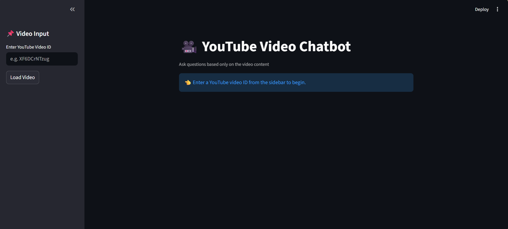
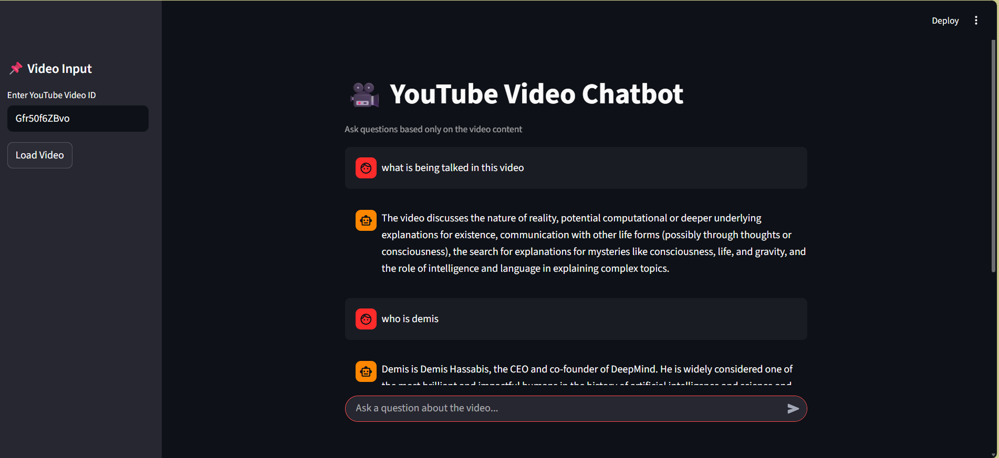
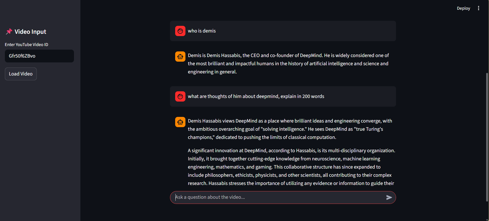
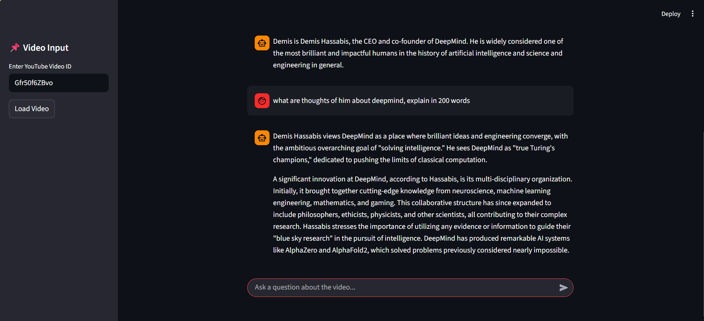

# 🎥 YouTube Video Chatbot

An **AI-powered YouTube Video Chatbot** that allows users to ask questions **strictly based on a video’s content**.  
The system fetches the video transcript, builds a semantic search index, and answers queries using **Retrieval-Augmented Generation (RAG)**.

---

## 🚀 Features

- 🔍 Ask questions grounded **only in the video transcript**
- 🌐 Supports **English & Hindi videos**
  - Automatically detects transcript language
  - Translates Hindi → English before processing
- 🧠 Uses **RAG (Retrieval-Augmented Generation)**
- ⚡ Fast semantic search using **FAISS**
- 🎨 Interactive **Streamlit web interface**
- 🔐 API keys kept secure using `.env`

---

## 🧠 Architecture Overview

1. **Transcript Ingestion**
   - Fetches YouTube subtitles (auto/manual)
   - Detects language (English / Hindi)
   - Translates Hindi transcripts to English (Gemini)

2. **Text Processing**
   - Recursive text splitting
   - Embedding generation
   - FAISS vector index creation

3. **RAG Pipeline**
   - Similarity search on transcript chunks
   - Prompt construction with retrieved context
   - Answer generation using Gemini chat model

---

## 🖼️ Demo Screenshots

### 🔹 Home Screen


### 🔹 Video Loaded & First Question


### 🔹 Follow-up Context-Aware Question


### 🔹 Long-form Answer from Video Context


---

## 🛠️ Tech Stack

- **Python**
- **LangChain**
- **Google Gemini (Chat + Translation)**
- **FAISS** (Vector Store)
- **YouTube Transcript API**
- **Streamlit**
- **Hugging Face / Gemini Embeddings**
- **dotenv**

---

## 📁 Project Structure

```text
yt_chatbot/
│
├── ingest.py          # Transcript fetching, language detection, embeddings
├── chatbot.py         # RAG pipeline and chatbot logic
├── main.py            # CLI-based chatbot
├── streamlit_app.py   # Web UI using Streamlit
├── requirements.txt   # Dependencies
├── .env               # API keys (not committed)
├── README.md          # Project documentation
└── *.png              # Demo screenshots
