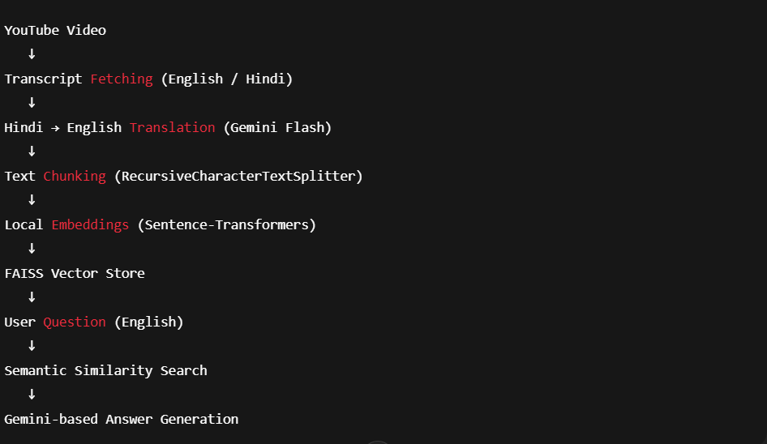

# 🎥 YouTube Video Chatbot (RAG-based)

A **Retrieval-Augmented Generation (RAG)** chatbot that allows users to ask **English questions** about a YouTube video.  
The system automatically handles **English and Hindi transcripts**, translates when required, embeds content locally, and generates grounded answers using **Gemini**.

---

## 🚀 Features

- 🔍 Ask questions about any YouTube video  
- 🌐 Multilingual transcript support  
  - English → used directly  
  - Hindi → auto-translated to English  
- 🧠 Retrieval-Augmented Generation (RAG)  
- ⚡ Free local embeddings (Hugging Face)  
- 📦 FAISS vector store for fast semantic search  
- 🤖 Gemini-powered reasoning  
- 🖥️ Streamlit web interface  
- 🔐 Secure API key handling via environment variables  

---

## 🏗️ Architecture Overview

